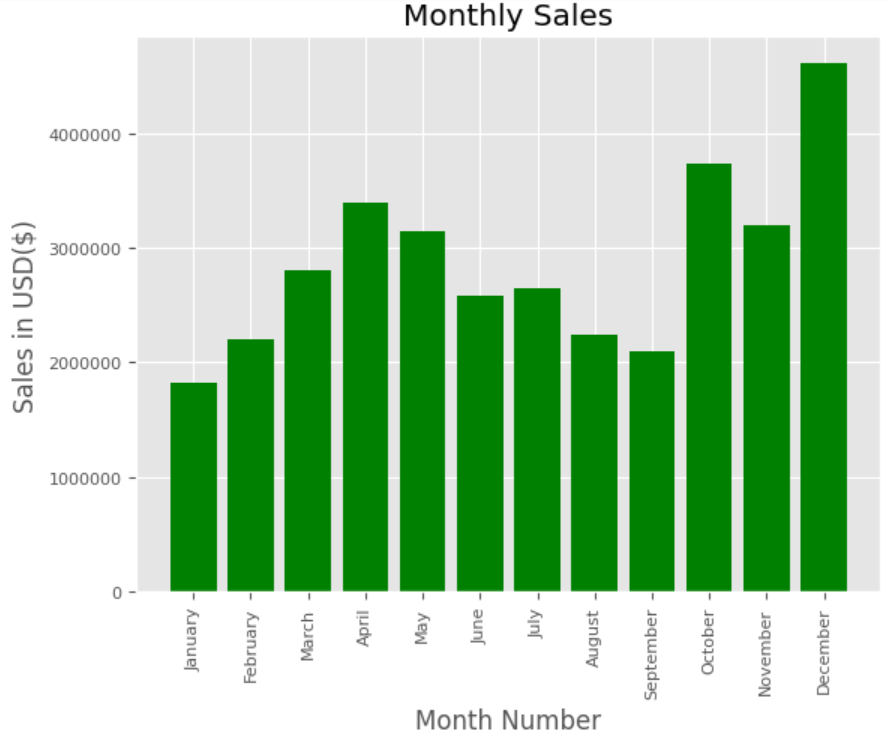
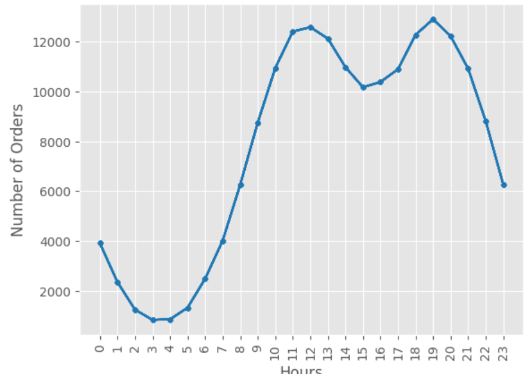

# Sales Analysis Using Python

The main purpose of sales analysis is to turn sales data into insights that can be used to improve a bottom line of a business. By analyzing sales data, companies can identify trends, understand what's working and what's not, and make data-driven decisions to boost sales and grow revenue.


### Data Analysis
I have done the data cleaning, analysis and visualization using Python. The dataset for this analysis have been collected from different sources month wise for a year. Then those datasets were merged together using the Pandas library.


### Data Questions
My objective was to collect the data from different sources and perform required analysis, and answer the following questions:

* What was the best month for Sales? How much was earned that month?
* What city had the highest number of sales?
* What time should we display advertisements to maximize likelihood of customer's buying product?
* What product was sold the most? What was the reason behind it?

#### Importing the necessary module
```python
import pandas as pd
import matplotlib.pyplot as plt
import seaborn as sns
import os
import datetime
```

#### Merging data of 12 months together into a single file
```python
df = pd.read_csv("./Sales_Dataset/Sales_April_2019.csv")

files = [file for file in os.listdir('./Sales_Dataset/')]

all_months_data = pd.DataFrame()

for file in files:
    df = pd.read_csv("./Sales_Dataset/"+file)
    all_months_data = pd.concat([all_months_data, df])


all_months_data.to_csv("all_data.csv", index=False)
```

#### Taking a look at the head of the dataframe which contains all the data
```python
all_data = pd.read_csv("all_data.csv")
all_data.head()
```


#### There are six variables in the dataframe
- __Order ID__: The unique Id of each sale's record
- __Product__: Description of the product
- __Quantity Ordered__: Number of items ordered of that particular product
- __Price Each__: Price per unit of the product
- __Order Date__: Date on which the product was ordered
- __Purchase Address__: Delivery Address of the order

### Cleaning the dataset

There are some rows with nan values so, I will drop those rows
```python
nan_df = all_data[all_data.isna().any(axis=1)]
nan_df.head()
```
I am going to create a new dataframe with those sales details where there are actual values to work with rather than just repeations of the column names
```python
all_data = all_data[all_data['Order Date'].str[0:2] != 'Or']
all_data.head()
```
Now I need to change the data type of 'Quantity Ordered' and 'Price Each' to numbers.
```python
all_data["Quantity Ordered"] = pd.to_numeric(all_data['Quantity Ordered'])  # making int
all_data["Price Each"] = pd.to_numeric(all_data['Price Each'])
```
Some new columns were needed to be augmented with the already existing ones in the dataset. __'Month'__, __'Sales'__ and __'city'__ are the new columns which are added.
```python
all_data['Month'] = all_data['Order Date'].str[0:2]
all_data['Month'] = all_data['Month'].astype('int32')
```


```python
all_data["Sales"] = all_data["Quantity Ordered"] * all_data["Price Each"]
```


```python
def getState(address):
    return address.split(",")[2].split(' ')[1]

def getCity(address):
    return address.split(',')[1]

all_data['City'] = all_data['Purchase Address'].apply(lambda x: f"{getCity(x)} ({getState(x)})")
```


### Finally, the data is prepared and can be used for data visualization
### ```1. What was the best month for Sales? How much was earned that month?```

Firstly, I grouped my dataframe by the 'Month' parameter using the `groupby()` function and calculated the `sum()`.
```python
all_data.groupby('Month').sum(numeric_only=True)
```


Now I have used the bar chart from `matplotlib.pyplot().bar()` to plot the __Monthly Sales__
```python
plt.ticklabel_format(style='plain')

months = [datetime.date(1900, monthinteger, 1).strftime('%B') for monthinteger in range(1,13)]
results = all_data.groupby('Month').sum(numeric_only=True)

plt.title("Monthly Sales")
plt.bar(months, results['Sales'], color="green")

plt.xticks(months, rotation="vertical",size=8)
plt.yticks(size = 8)
plt.xlabel('Month Number')
plt.ylabel('Sales in USD($)')

plt.show()
```


The month of __December__ has the __highest sale__ from all the other months. The total sales in December is about 4 million dollars. This might happen because it is month of cheerful christmas, for that reason the business was so good.


### ```2. What city had the highest number of sales?```
Here I have grouped the dataset by 'City' parameter using the `groupby()` and have calculated the `sum()`.
```python
all_data.groupby('City').sum(numeric_only=True)
```


I have used a bar chart from `matplotlib.pyplot().bar()` to plot the total sales in each city.
```python
records = all_data.groupby('City').sum(numeric_only=True)
cities = [city for city in records.index]

plt.ticklabel_format(style='plain')
plt.bar(cities,records['Sales'],color="tab:blue")
plt.xticks(cities,rotation="vertical", size=8)
plt.xlabel('Cities')
plt.ylabel('Sales in USD($)')

plt.show()
```


### `3. What time should we display advertisements to maximize likelihood of customer's buying product?`
I have changed the 'Order Date' column to __datetime__ type using the `to_datetime()`.
```python
all_data['Order Date'] = pd.to_datetime(all_data['Order Date'])
```
I have augmented two new columns __Hour__ and __Minute__. As I would need the __Hour__ column to group the dataset.
```python
all_data['Hour'] = all_data['Order Date'].dt.hour
all_data['Minute'] = all_data['Order Date'].dt.minute
all_data.head()
```


I have used a line graph from `matplotlib.pyplot.plot()`
```python
results = all_data.groupby(['Hour']).count()
hours = [hour for hour in results.index]

plt.plot(hours,results,marker=".",color="tab:blue")
plt.xticks(hours, rotation="vertical")
plt.xlabel("Hours")
plt.ylabel("Number of Orders")

plt.show()
```


As we can see that the number of orders went up at the __12 hours__ and __19 hours__ ususally so, the advertisements can be rolled out at __10__ or __11 hours__ and again at __17__ or __18 hours__. This can increase the number of orders rapidly.

### `4. What product was sold the most? What was the reason behind it?`
First, I have used a bar chart from `matplotlib.pyplot().bar()` to plot the __Quantity of each type of Products ordered__
```python
product_group = all_data.groupby('Product')
quantity_ordered = product_group.sum(numeric_only=True)['Quantity Ordered']

products = [prd for prd in quantity_ordered.index]

plt.bar(products,quantity_ordered, color="tab:blue")
plt.xticks(products, rotation="vertical", size=8)
plt.xlabel("Products")
plt.ylabel("Quantity Ordered")

plt.show()
```


Now to find out why __AAA Batteries(4-pack)__ was the most sold item, I needed to compare the prices of each item. In order to do that I created an overlay line graph for the prices of each item using `matplotlib.pyplot.subplots()`.The price is marked as a second y-axis.

```python
prices = all_data.groupby('Product').mean(numeric_only=True)['Price Each']

fig, ax1 = plt.subplots()

ax2 = ax1.twinx()
ax1.bar(products,quantity_ordered,color="tab:blue")
ax2.plot(products,prices,color="red",label="Price")
ax1.set_xticklabels(products,rotation="vertical",size=8)

ax1.set_xlabel('Products')
ax1.set_ylabel('Quantity Ordered')
ax2.set_ylabel('Price($)')

plt.legend()
plt.show()
```


From the overlay graph of proces it is very much evident why the sales of the __AAA Batteries (4-pack)__ is so high because it is the cheapest product among all the others. The prices of the __LG Dryer__ and __LG Washing Machine__ are significantly less than the prices of the __Macbook Pro__ and __Thinkpad Laptop__, still the quantity of orders for Macbooks and Thinkpads are more then LG Dryer and Washing. This might happend because the Laptops are mostly used for educational and work purposes and they are used by each and every students and working professionals so there quantity of orders are higher than LG Dryers and Washing Machine.
