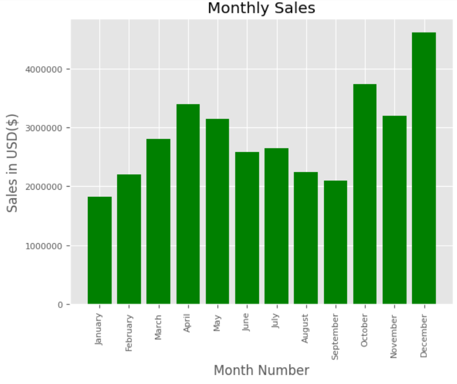
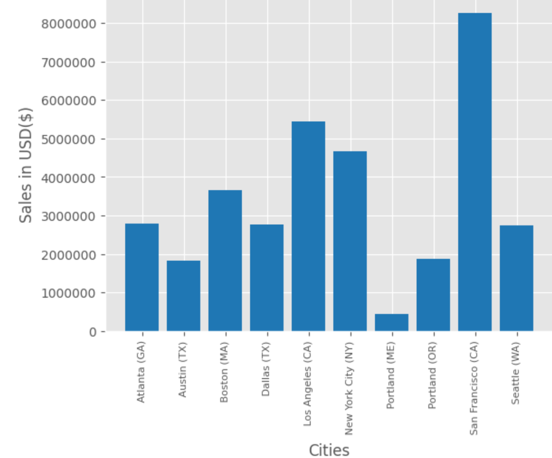
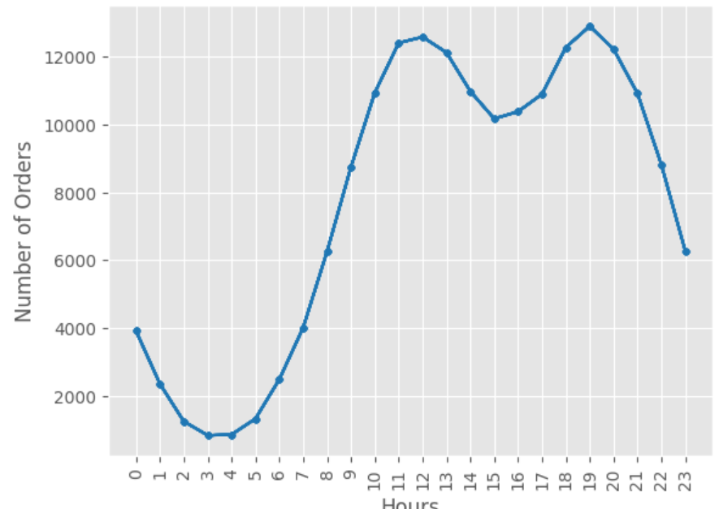
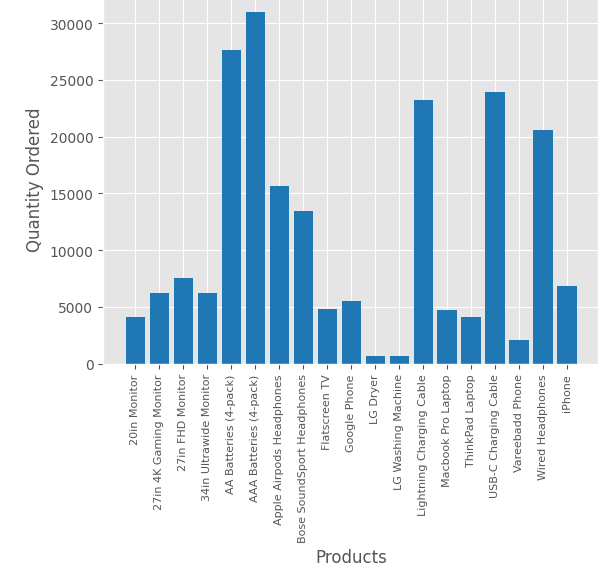

# Sales Analysis Using Python

The main purpose of sales analysis is to turn sales data into insights that can be used to improve a bottom line of a business. By analyzing sales data, companies can identify trends, understand what's working and what's not, and make data-driven decisions to boost sales and grow revenue.


### Data Analysis
I have done the data cleaning, analysis and visualization using Python. The dataset for this analysis has been collected from different sources month-wise for a year. Then those datasets were merged using the Pandas library.


### Data Questions
My objective was to collect the data from different sources and perform required analysis, and answer the following questions:

* What was the best month for Sales? How much was earned that month?
* What city had the highest number of sales?
* What time should we display advertisements to maximize likelihood of customer's buying product?
* What product was sold the most? What was the reason behind it?

### IMPORTANT INSIGHTS
### ```1. What was the best month for Sales? How much was earned that month?```



__December__ consistently achieves the highest sales compared to all other months, with total sales reaching approximately ___$4 million___. This surge in sales can be attributed to the festive Christmas season, which significantly boosts business activity.


### ```2. What city had the highest number of sales?```



__San Francisco (CA)__, __Los Angeles (CA)__, and __New York City (NY)__ account for approximately ___53%___ of total sales, making them the top three cities in this metric.

### `3. What time should we display advertisements to maximize likelihood of customer's buying product?`



The number of orders increased by approximately ___14%___ around the __12th__ and __19th__ hours. Therefore, rolling out advertisements at __10-11 hours__ and again at __17-18 hours__ could significantly boost order numbers.

### `4. What product was sold the most? What was the reason behind it?`


Together, __AA Batteries (4-pack)__ and __AAA Batteries (4-pack)__ are the top-selling items, contributing approximately ___15%___ of the total sales.

### CONCLUSION
To maximize the bottom line, several key strategies emerge from the sales analysis:

* ___Capitalize on December Sales___: Focus on the festive season, especially December, which generates around $4 million in sales.

* ___Target Top Cities___: Prioritize marketing efforts in San Francisco, Los Angeles, and New York City, as they account for 53% of total sales.

* ___Optimize Ad Timing___: Roll out advertisements at 10-11 AM and 5-6 PM to leverage the 14% increase in orders around the 12th and 19th hours.

* ___Promote Best-Sellers___: Highlight AA and AAA Batteries (4-pack), as they contribute 15% to total sales.

Implementing these strategies will enhance sales performance and drive revenue growth.
